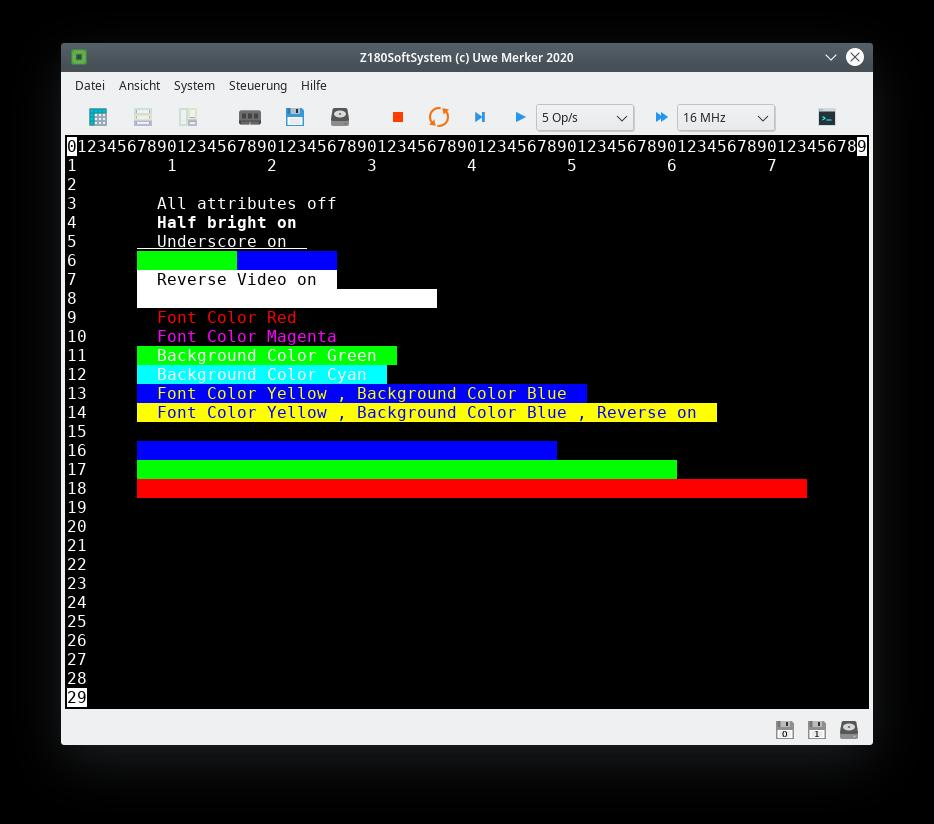

# **Z180SoftSystem** #

Z180SoftSystem emuliert einen 8Bit-Mikrocomputer auf Basis einer Zilog Z180 MPU.
Emuliert werden:
- 8 - 64KB per Software abschaltbares Boot-ROM. Das Boot-ROM wird nach einem Reset wieder ab Adresse 0 eingeblendet.
- 64 - 1024KB System RAM.
- Ein WD1770 kompatibler Disketten-Controller mit maximal 1440KB pro Diskette und maximal 2 Disketten-Laufwerken.
- Ein ATA1 kompatibles Festplatten-Laufwerk mit einer maximalen Kapazität von 1008MB . 
- Ein DS12887B kompatibler Uhren-Chip mit CMOS-RAM.
- Ein ANSI/VT100 kompatibles Text-Terminal. Dieses ist am ASCI-Port 0 der Z180MPU angeschlossen.
- Z180-DMA Kanäle 0 und 1.
- Z180-ASCI Kanäle 0 und 1. (ASCI-DMA funktioniert)
- Z180-PRT Kanäle 0 und 1.
- Z180 TRAP-Interrupt.
- Z180 Memory Management Unit.
- Die Z180MPU internen Funktionen (DMA, ASCI, PRT, TRAP) können Interrupts generieren auf welche auch reagiert wird (Interrupt Mode 2).

Das Z180SoftSystem war ursprünglich für die Emulation eines CP/M-Systems gedacht. Es sollten sich darauf jedoch auch andere Systeme z.B. UZI80 anpassen lassen. Im Hilfe Menü des Programmes sind sämtliche emulierten Funktionen mit den jeweiligen Port-Adressen aufgeführt.

Entwickelt wird das Z180SoftSystem mit der Free Pascal / Lazarus Entwicklungsumgebung. Es werden keine externen Packages benötigt, so das sich der Source-Code mit einer Lazarus Standard-Installation kompilieren lässt.
